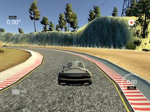

# Behavioral Cloning using Udacity simulator

[//]: # (Image References)

[image1]: ./images/bright.png "Bright Image"
[image2]: ./images/clr.png "YUV image"
[image3]: ./images/crop.png "Crop Image"
[image4]: ./images/flip.png "flip Image"
[image5]: ./images/normal.png "normal Image"
[image6]: ./images/resized.png "resized Image"
[image7]: ./images/recovery.gif "recovery Image"

The Behaviour cloning project involves in training a convolution neural network to learn a driver behaviour and reproduce the behaviour to autonomously navigate a trained path.

In this project the following tasks are accomplished.

- Generate training data set by driving in the unity simulator.
- Design and implement the convolution neural network architecture.
- Train the model using the training data set.
- Generate a sucessfull drive around the track in an autnomous mode using the trained model.

Files Uploaded

- model.py - This conatins the script to train and validate the model. The network architecure is implemented in the file.
- drive.py - The script to drive the car in autonomous mode using the trained model.
- imagemanager.py - The script that contains the utilities to read the image, peform necessary image processing and a generator to feed the model.
- model.h5 - The trained model weights.
- Video.mp4 - The video of the center camera during the autonomous drive.

A youtube link of the screen capture is available here.

|										Autonomous Drive Video					       |
|:------------------------------------------------------------------------------------:|
||

## Model Architecture and Training Strategy

The implementation is based on the [NVIDIA model] (https://devblogs.nvidia.com/parallelforall/deep-learning-self-driving-cars/). 

The architecture seems to be proven for this project. The architecture is based on several layers of convolution network followed by several fully connected layers.

The following additions are made to adapt the model to this project.
- A lambda layer is added to normalise the training data. ( Code line 82)
- A specific learning rate is used for the adam optimizer.
- In order to avoid overfitting a dropout layer has been added. .( Code line 100)

|layer				 | shape  				 |
|:------------------:|:---------------------:|
|Input Normlaisation | 66 x 200 x 3			 |
|Convolution 		 | Filter 24, Kernel (5 x 5), Stride (2 x 2) , "elu"|
|Convolution 		 | Filter 36, Kernel (5 x 5), Stride (2 x 2) , "elu"|
|Convolution 		 | Filter 48, Kernel (5 x 5), Stride (2 x 2) , "elu"|
|Convolution 		 | Filter 64, Kernel (3 x 3), Stride (2 x 2) , "elu"|
|Convolution 		 | Filter 64, Kernel (3 x 3), Stride (2 x 2) , "elu"|
|Dropout 		 	 | 0.5					 |	
|Flatten 		 	 | 1164, "relu"			 | 
|Dense  		 	 | 100, "relu"			 | 
|Dense  		 	 | 50, "relu"			 |
|Dense  		 	 | 10, "relu"			 |
|Dense  		 	 | 1, 			 		 |

The model uses RELU functions in the dense layer and ELU function in the convolution layer to introduce non-linearity in the layers. 

#### Model parameter tuning

After monitoring several training session a learning rate of 1e-4 was choosen for the adam optimiser.

#### Training data

The behaviour of the car in the simulator is very sensitive to the quality of the training data and driver behaviour. After serveral attempts a good sample of training data was generated to train the model. Methods employed to train the model is covered in the next section.

- A comparison of the steering angle of the udacity dataset and my initial training set was compared. The udacity steering angle and drive was much smoother and cleaner for the model to learn a better behaviour. Driving with keyboard casued several overshoot. I managed to create a similar dataset to udacity.

                                        
![Normal][image5]

##### Image Augumentation

- The normal image was cropped to removed the unwated sky and front hood of the car.

                                        
![Cropped][image3]

- The nvidia model also recommends to use YUV colour space and the accepts a size of 66x200x3

![YUV colour Space][image2]

I added the additional augumentation for increased training scenarios for the model.

- The images are flipped to provide more addition clockwise direction as the track is mostly anit-clockwise drive. I ensured the steering angle was also altered accordingly to match the flipped image. Random brightness / darkness also added to improve the performance.

![YUV colour Space][image2] ![flipped][image4]

- My original model without dropouts had higher loss on the validation set when compared to the training set. I added a droput layer to address this issue.

- The model tested on the simulator autonomous mode performed reasonable in normal curves, but initial version did had not so good performance in sharp corners.

- A few laps of clockwise direction was added to the dataset for the model to generalise well. A few scenarios of recovery situation was added to key sharp sections. This helped the model to perform better on those situations.

- Introduction of left and right camera data provide a better perspective for the model in recovery scenarios. This is supported by a steering offset of 0.2.

                                        
 ![Recovery Right][image6]

####3. Creation of the Training Set & Training Process

To capture good driving behavior, I first recorded two laps on track one using center lane driving. Here is an example image of center lane driving:

I then recorded the vehicle recovering from the left side and right sides of the road back to center so that the vehicle would learn to .... These images show what a recovery looks like starting from ... :
